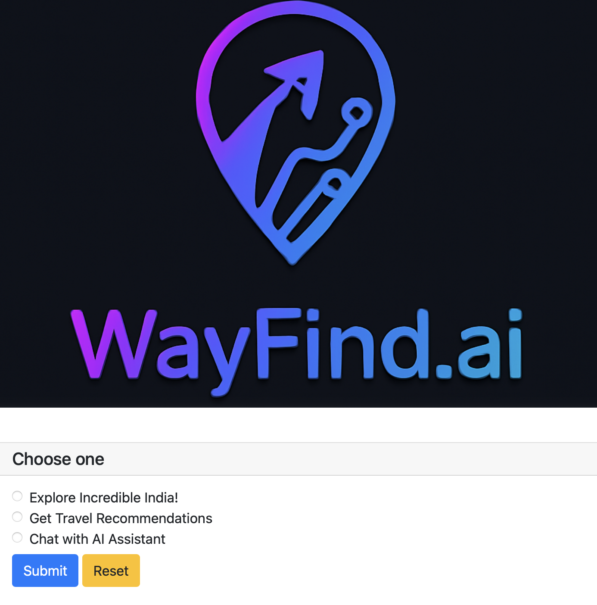
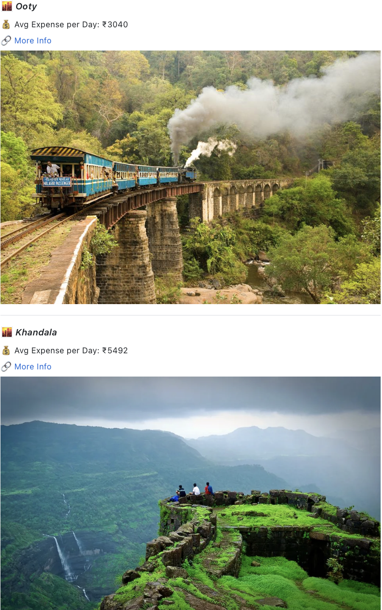
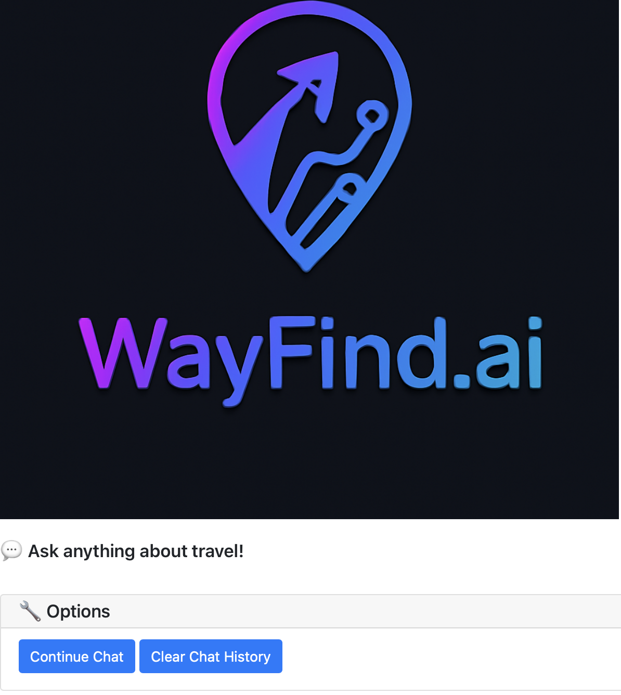
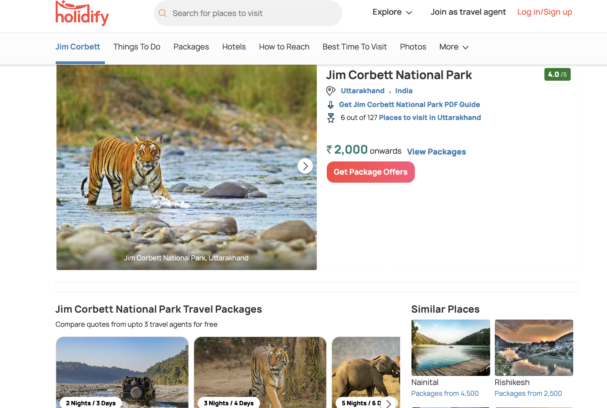

# Wayfind.AI — Travel Recommendation & Chatbot System  

  
  
  
  
  

Wayfind.AI is a **Flask + PyWebIO web application** that helps travelers:  
- Explore destinations across India  
- Get AI-powered travel recommendations  
- Chat with an AI Travel Assistant powered by Hugging Face  

---

## Features  

- Explore Incredible India – Browse destinations with images and links  
- Recommendation System  
- Free-text query (e.g., `snow trekking, tiger safari`)  
 - Destination similarity (find places similar to one you visited)  
- AI Travel Assistant – Interactive chatbot using `DialoGPT-medium`  
- Optimized with SBERT embeddings (`all-MiniLM-L6-v2`)  
- Embedding caching with PyTorch for **fast reloading**

---
## Screenshots  

### Home Page

### Explore India

### Recommendations

### Chatbot

### moreinfo

## Tech Stack  

- **Backend**: Flask, PyWebIO  
- **NLP Models**:  
  - [Sentence-BERT (`all-MiniLM-L6-v2`)](https://huggingface.co/sentence-transformers/all-MiniLM-L6-v2)  
  - [DialoGPT-medium](https://huggingface.co/microsoft/DialoGPT-medium)  
- **Libraries**: `torch`, `transformers`, `sentence-transformers`, `pandas`, `numpy`, `matplotlib`, `nltk`  
- **Dataset**: `travel_destinations.csv`, `destinations_with_processed_text.csv`  
- **Images**: Stored in `DestinationPics/`  

---

## Project Structure  

wayfind-ai/
 - app.py # Main Flask + PyWebIO application
 - travel_destinations.csv # Raw dataset with City, description, cost, links
 - destinations_with_processed_text.csv # Preprocessed dataset for SBERT
 - corpus_embeddings.pt # Cached embeddings (auto-generated on first run)
 - requirements.txt # Python dependencies
 - README.md # Project documentation
 - DestinationPics/ # Destination images folder
    logo.jpg
    India_1.jpg
    Delhi.jpg
    Manali.jpg
    Goa.jpg
    Jaipur.jpg
    Kerala.jpg
... (other city images)

# Installation
 1) -Create and activate a virtual environment
  python -m venv venv
  source venv/bin/activate    # macOS/Linux
  venv\Scripts\activate       # Windows

 2) Install dependencies
  pip install -r requirements.txt
  Download NLTK resources (first run only)
  import nltk
  nltk.download('stopwords')
  nltk.download('wordnet')

# Running the App
 Run the application using:
 python app.py
 Then open your browser at: http://localhost:8080/